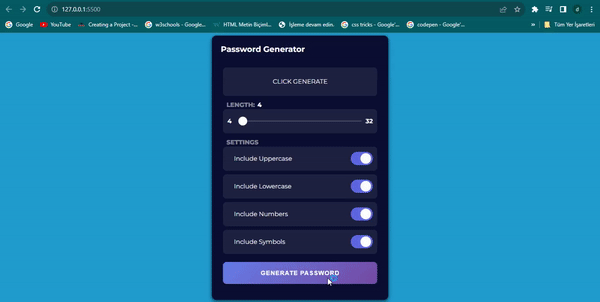
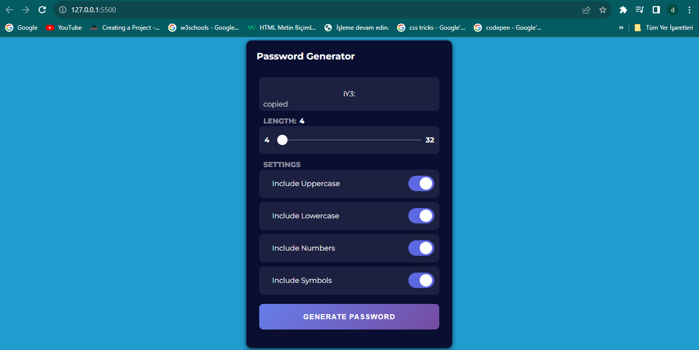
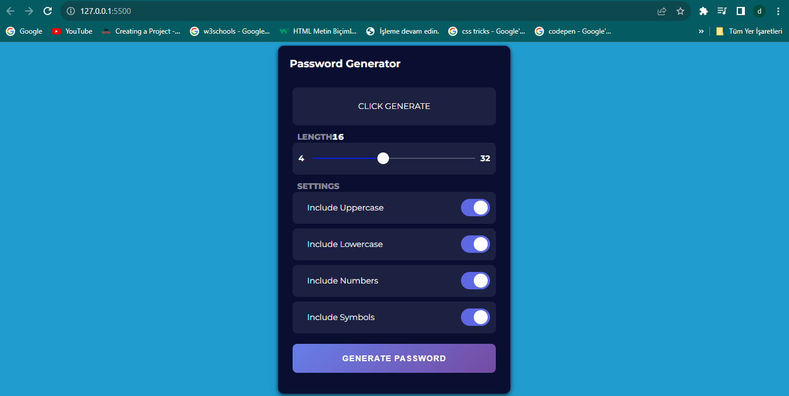

Şifre Oluşturucu Uygulaması
Bu proje, HTML, CSS ve JavaScript kullanarak basit bir şifre oluşturucu uygulaması oluşturmanıza yardımcı olur. Bu uygulama, güçlü ve rasgele şifreler oluşturmanıza yardımcı olur.

Nasıl Kullanılır
Bu projeyi bilgisayarınıza klonlayın veya ZIP dosyası olarak indirin.

Projenin ana dizinindeki index.html dosyasını çift tıklayarak web tarayıcınızda açın.

Şifre uzunluğunu ve hangi karakter türlerini (büyük harf, küçük harf, rakam, özel karakterler) içereceğini seçin.

"Şifre Oluştur" düğmesine tıklayarak rasgele bir şifre oluşturun.

Oluşturulan şifreyi panoya kopyalamak için "Panoya Kopyala" düğmesine tıklayın ve bu şifreyi kullanmak için başka bir uygulamada yapıştırabilirsiniz.

Proje Yapısı
index.html: Uygulamanın ana HTML dosyası.
style.css: Uygulamanın CSS dosyası, kullanıcı arayüzü için tasarımı içerir.
script.js: Uygulamanın JavaScript dosyası, şifre oluşturma mantığını ve olayları içerir.
Katkıda Bulunma
Eğer bu projeye katkıda bulunmak isterseniz, aşağıdaki adımları izleyebilirsiniz:

Bu projeyi forklayın (kendi GitHub hesabınıza kopyalayın).

Yeni özellikler ekleyin veya hataları düzeltin.

Değişikliklerinizi yaparken açıklayıcı commit mesajları kullanmaya özen gösterin.

Değişikliklerinizi kendi forkunuzda test edin.

Pull Request (Çekme İsteği) göndererek değişikliklerinizi bu repo ile paylaşın.

Lisans
Bu proje MIT Lisansı altında lisanslanmıştır. Daha fazla bilgi için LICENSE dosyasını inceleyebilirsiniz.

İletişim
Eğer sorularınız veya geri bildiriminiz varsa, lütfen bana e-posta veya GitHub üzerinden mesaj gönderin.

Bu README dosyası, şifre oluşturucu uygulamanızın kullanımını ve geliştirme sürecini anlamak için bir temel sağlar. Projenizi daha fazla özelleştirmek ve geliştirmek için kodunuzu iyileştirebilirsiniz.

